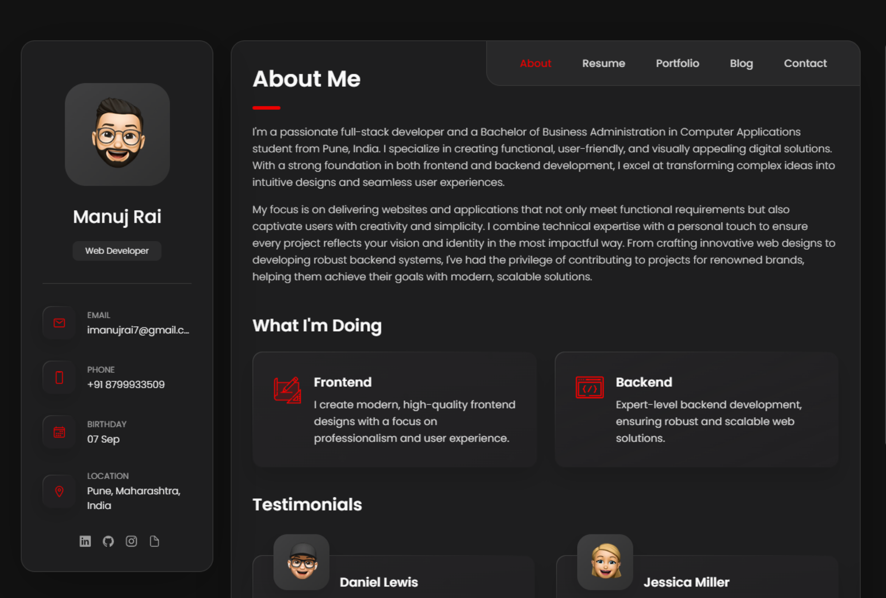

# vCard - Personal Portfolio

**vCard** is a fully responsive personal portfolio website, optimized for all devices. Built using HTML, CSS, and JavaScript, it showcases your skills, projects, and provides a way for people to contact you.

## Preview

## Features

- Fully responsive design, works seamlessly on all devices.
- Clean, minimalist layout for a professional presentation.
- Easy to customize with clear code structure.
- Simple, yet modern, design focused on user experience.

## Technologies Used

- HTML5
- CSS3
- JavaScript

## Contact

If you want to contact me you can reach me at
- [LinkedIn](https://www.linkedin.com/in/manujrai/).
- [Instagram](https://www.instagram.com/manuj_rai_official).
- [Mail](mailto:imanujrai7@gmail.com).

